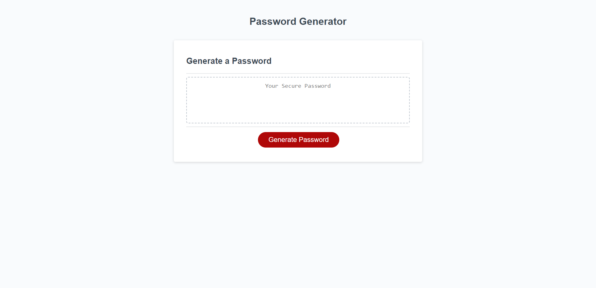

# Password Generator

## Description

A simple program that generates a random password based on user-specified criteria.

## Features

- Prompts the user for their desired password length (minimum 10 characters, maximum 64 characters).
- Allows the user to select which character types to include in the password: special characters, numeric characters, lowercase characters, and uppercase characters.
- Generates a random password that meets the specified length and character type requirements.
- Displays the generated password in the page.

## Usage

1. Follow the [link](https://https://willguille.github.io/password-generator/)
2. Click the "Generate Password" button.
3. Follow the prompts to specify your desired password options.
4. Your generated password will be displayed in the `#password` element on the page.

## License

Please refer to the LICENSE in the repo.